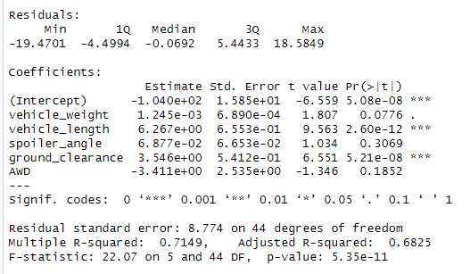
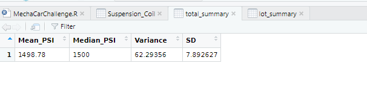
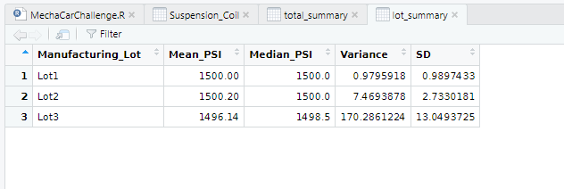

# MechaCar_Statistical_Analysis
For this module, R programming language was used to conduct a statistical analysis in RStudio. The MechaCar_mgp and Suspension_Coil data were used along with the dplyr library for this project.

## Linear Regression to Predict MPG
A linear model that predicts the mpg of prototypes using multiple metrics such as vehicle length, vehicle weight, spoiler angle, drivetrain, and ground clearance was generated.  Then summary statistics were generated for the linear regression model leading to either reject or fail to reject the null based on an assumed significance level of 0.05%.

### *Figure 1*

Based on Figure 1, both vehicle_length and ground_clearance p-values are smaller than the assumed significance level of 0.05% and therefore providing a non-random amount of variance to the MPG values.

The slope of the line model is not zero.

The model does not predit mpg of MechaCar prototypes effectively.  The other metrics have a larger p-value than our assumed significance level of 0.05% indicating a random amount of variance. 

## Summary Statistics on Suspension Coils

### *Figure 2*

## *Figure 3*

As seen in Figure 3, the current manufacturing data does not meet the design specification for lot3 because it exceeds the allowable PSI variance level of 100 pounds per square inch.  The total variance in Figure 2 and the other Lots 2 and 3 do meet the design specification. 

## T-Tests on Suspension Coils

### *Figure 4*

The p-values in Figure 4 that are greater than our assumed significance level of 0.05% would fail to reject the null hypothesis. 

## Study Design: MechaCar vs Competition

One statistical study that can quantify how the MechaCar performs against the competition using metrics that would be of interest to a consumer would be a statistical study on safety ratings (dependent variable) and cost (independent variable) and so on.  A statistical test could then explain if the metrics vary, on average, between the two companies.   The null Hypothesis would be that MechaCar metrics are equal to a competitive company.  The alternate hypothesis would be that MechaCar metrics are not equal to the competitive company.  A two-sample t-test could be used to compare the metric mean from one population to the metric mean of the other population. 

